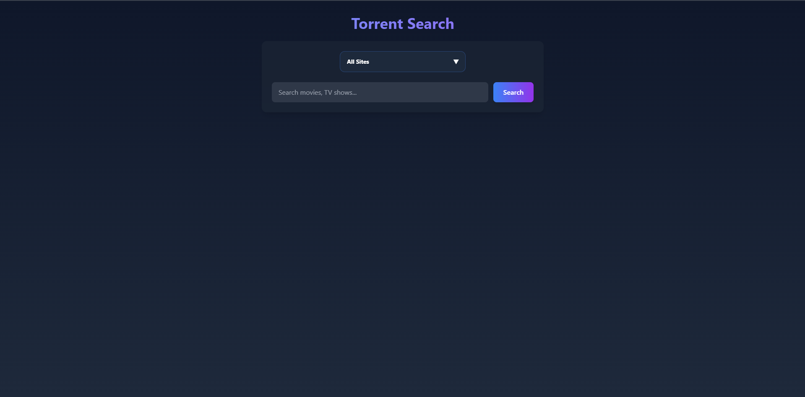
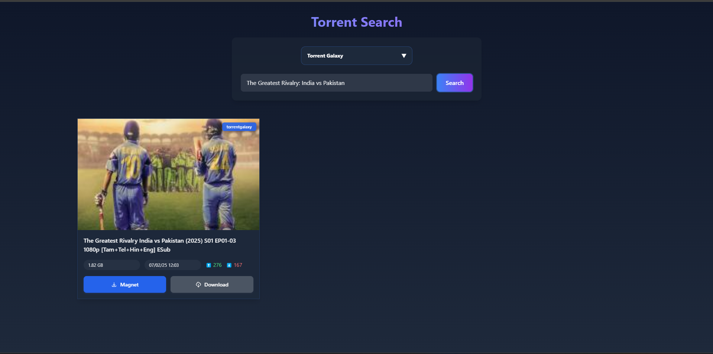

# 🚀 Torrent Searcher API with Website

## 🌟 Overview
Welcome to the ultimate torrent search solution! This powerful project combines a robust API for scraping torrents from popular sites with a sleek, modern web interface. Whether you're a developer looking to integrate torrent search capabilities or a user seeking an intuitive way to find content, we've got you covered!

## ✨ Key Features

### 🔍 Advanced Search Capabilities
- **Multi-Site Search**: Simultaneously search across 15+ popular torrent sites
- **Smart Filtering**: Filter results by size, date, seeders, and more
- **Real-Time Updates**: Get instant results as you type
- **Category Support**: Browse specific categories like movies, TV shows, etc.

### 💻 Modern Web Interface
- **Stunning UI/UX**: Beautiful, intuitive design with glass morphism effects
- **Responsive Design**: Perfect experience on desktop, tablet, and mobile
- **Dark Mode**: Easy on the eyes with dark theme support
- **Quick Actions**: One-click magnet link copying and downloading
### 🛠️ Developer-Friendly API
- **RESTful Architecture**: Clean, well-documented API endpoints
- **JSON Responses**: Structured data perfect for integration
- **Rate Limiting**: Built-in protection against abuse
- **CORS Enabled**: Ready for cross-origin requests

# Screenshots 

See here

## 🌐 Supported Sites
- 1337x
- The Pirate Bay
- YTS
- RARBG
- EZTV
- Torrent Galaxy
- Nyaa.si
- And many more!

## 🚀 Getting Started
1. **Quick Search**: Visit our web interface at [website URL]
2. **API Usage**: Check our [API Documentation](https://github.com/bipuldey19/Torrent-Searcher-API-with-Website) for integration
3. **Self-Hosting**: Follow our deployment guides for various platforms

## 🤝 Contributors Hall of Fame

| Contributor | Amazing Contributions |
|------------|---------------------|
| [RyukMe](https://github.com/Ryuk-me) | 🏗️ Core API Architecture 🚀 Heroku Deployment Support |
| [Bipuldey](https://github.com/bipuldey19) | 🎨 Web Interface Design 📦 Netlify Integration |
| [Juned KH](https://github.com/junedkh) | ⚡ Vercel Deployment 🛠️ Frontend Development |
| [Ovin](https://github.com/vincreator) | 🔧 Replit Support 📚 Documentation |
